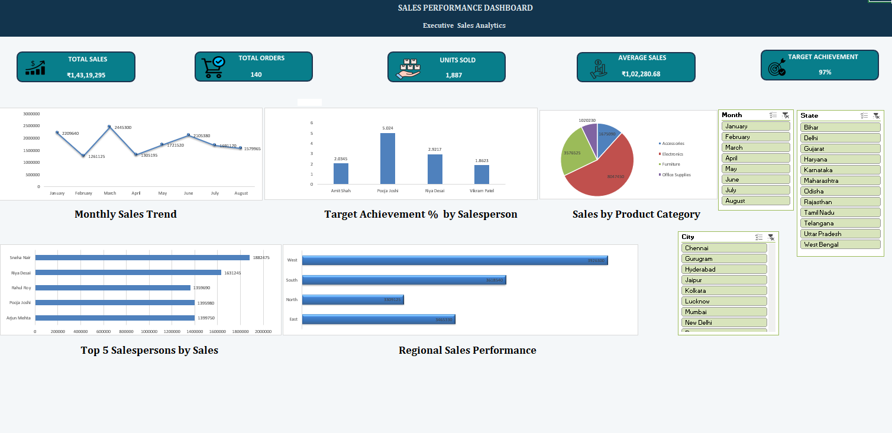

• Sales Performance Dashboard

An interactive Sales Performance Dashboard built using Microsoft Excel to analyze sales performance and generate meaningful business insights.

• Project Overview

This project transforms raw sales data into an interactive dashboard using Excel data analysis and visualization techniques.

• Tools & Skills

- Microsoft Excel
- PivotTables
- PivotCharts
- Data Analysis
- Data Visualization
- Interactive Slicers
- KPI Dashboard Design

• Dashboard Features

- Total Sales
- Total Orders
- Units Sold
- Average Sales
- Target Achievement
- Monthly Sales Trend
- Sales by Product Category
- Top 5 Salespersons by Sales
- Regional Sales Performance
- Interactive filters for Month, State and City

• Dashboard Preview

• Objective

To transform raw sales data into an interactive dashboard that provides clear insights into sales trends, salesperson performance, product categories and regional performance.

• Key Learning

Through this project, I strengthened my skills in Excel, PivotTables, PivotCharts, data analysis, dashboard design and data visualization.

• Author

**Venu**

Computer Science and Engineering Student | Aspiring Data Analyst
